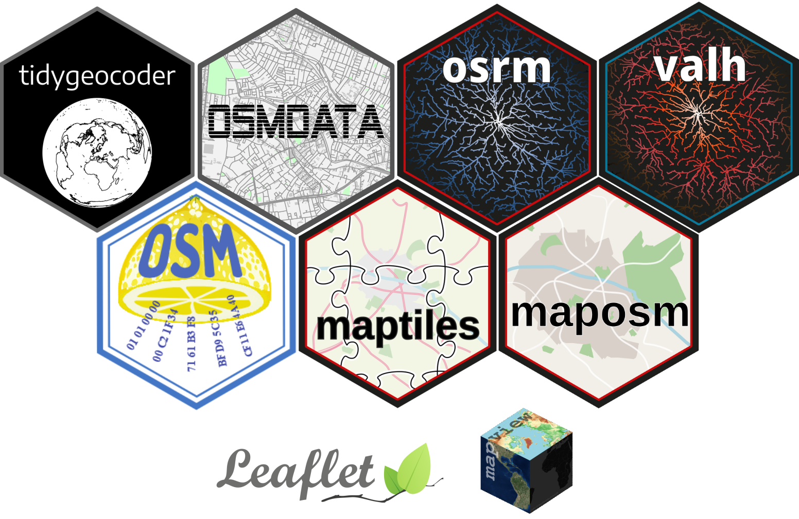

# Utiliser OpenStreetMap avec R

## Description :memo:

*Date* : 13/05/2025, 14h-17h  
*Évènement* : [ElementR](https://elementr.gitpages.huma-num.fr/website/apropos.html) 
*Durée* : Environ 3 heures

## Contenu :classical_building:

Cette séance propose de sensibiliser ses participants à l'usage d'OpenStreetMap (OSM) avec R. 
Après une présentation des spécificités et de l’écosystème de cette base de données participative, 
nous reviendrons sur les packages R utiles pour interfacer son contenu et réaliser des opérations variées : 
import de tuiles raster, géocodage, export de données géographiques, calcul d’itinéraires et temps de trajet avec différents modes de transport.
La présentation sera étayée d’exemples d’application issus des travaux et projets du RIATE. 
Cela permettra d’aborder des aspects connexes liés à la complétude des données, 
l’implémentation de méthodes d’interpolation spatiale, la mise en place d’engins de routage pour des calculs d’itinéraires massifs ou encore la création d’indicateurs d’accessibilité dérivés de matrices origine-destination.
Cette intervention se conclura par la présentation d’une chaîne de traitements reproductible 
qui résumera les éléments abordés durant la séance et qui pourra utilement être remobilisée dans d’autres contextes spatiaux ou thématiques. 

**La mise en pratique est accessible dans ce [dépôt](https://github.com/riatecom/osm-elementr-2025-application)**

## Voir la présentation :book:

La présentation est disponible en ligne à l'adresse suivante : (à compiler à la fin)

## Compilation de la présentation :computer:

- **Prérequis** :
    - [Quarto](https://quarto.org)

- **Étapes** :
    - Cloner le dépôt
    - Se placer dans le dossier `Magrit-MagisAR9-2024`
    - Lancer la commande `quarto render . --output-dir dist/`
    - Ouvrir le fichier `dist/index.html` dans un navigateur Web

## Licence :recycle:

Le contenu de ce dépôt est mis à disposition selon les termes de la [Licence CC BY-NC-SA 4.0 (Creative Commons - Attribution - Pas d’Utilisation Commerciale - Partage dans les Mêmes Conditions 4.0 International)](https://creativecommons.org/licenses/by-nc-sa/4.0/deed.fr).

## Auteurs :bust_in_silhouette:

[Ronan Ysebaert](https://github.com/rysebaert), [Louis Laurian](https://github.com/louislrn), Timothée Giraud et [Matthieu Viry](https://github.com/mthh).

