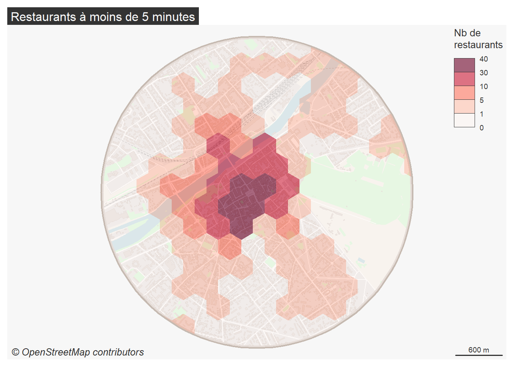

# Utiliser OpenStreetMap avec R

Présentation réalisée par Ronan Ysebaert, Louis Laurian, Timothée Giraud et Matthieu Viry (UAR RIATE pour le groupe [ElementR](https://elementr.gitpages.huma-num.fr/website/apropos.html) en mai 2025.

## Contenu

Cette séance propose de sensibiliser ses participants à l'usage d'OpenStreetMap (OSM) avec R. 
Après une présentation des spécificités et de l’écosystème de cette base de données participative, 
nous reviendrons sur les packages R utiles pour interfacer son contenu et réaliser des opérations variées : 
import de tuiles raster, géocodage, export de données géographiques, calcul d’itinéraires et temps de trajet avec différents modes de transport.
La présentation sera étayée d’exemples d’application issus des travaux et projets du RIATE. 
Cela permettra d’aborder des aspects connexes liés à la complétude des données, 
l’implémentation de méthodes d’interpolation spatiale, la mise en place d’engins de routage pour des calculs d’itinéraires massifs ou encore la création d’indicateurs d’accessibilité dérivés de matrices origine-destination.
Cette intervention se conclura par la présentation d’une chaîne de traitements reproductible 
qui résumera les éléments abordés durant la séance et qui pourra utilement être remobilisée dans d’autres contextes spatiaux ou thématiques. 

## Programme de la demi-journée (3h)

Rythmée par une présentation et une mise en application

**(1) OpenStreetMap - spécificités et usages possibles**

- Présentation d'OpenStreetMap : spécificités, histoire, organisation et usages
- L'évaluation de la qualité d'OSM
- Packages R de référence permettant d'interfacer OSM 
- Retour sur quelques cas d'usage dans les travaux du RIATE

Construire la présentation
`quarto render index.qmd`

**(2) Utiliser OpenStreetMap avec R - mise en pratique**

- Géocodage
- Import de tuiles OSM
- Import de couches géographiques OSM
- Carroyage
- Temps d'accès
- Itinéraires

Accessible dans ce [dépôt](https://github.com/riatecom/osm-elementr-2025-application)

